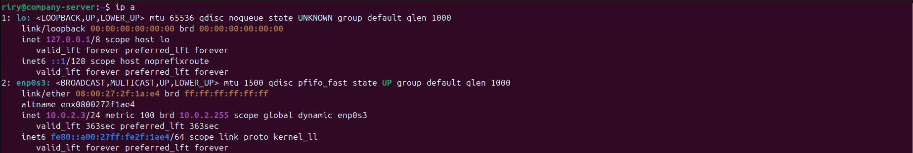
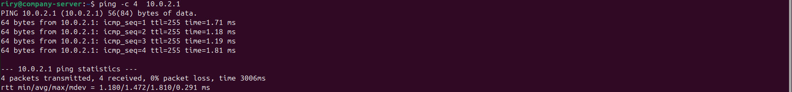
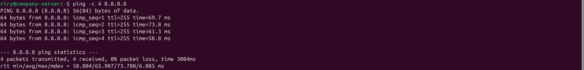
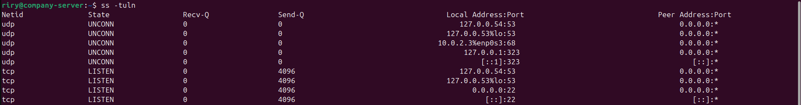

# Lab 03 - Linux Networking

## Objective

Practice verifying network connectivity, configuring network settings, examining routing information, and troubleshooting basic networking issues using essential Linux networking commands.

## Scenario

As a Junior Linux System Administrator, you are responsible for configuring and verifying the network connectivity of a newly deployed Ubuntu Server. Before the server can be used in a production environment, you must validate its network configuration, test communication with other devices, inspect routing information, and verify DNS resolution.

## Implementation

- Displayed network interface information.
- Verified local network connectivity.
- Tested Internet connectivity.
- Examined the routing table.
- Verified listening network ports.
- Checked DNS resolver configuration.
- Tested DNS name resolution.

## Commands Used

- `ip a`
- `ip route`
- `ping`
- `ss -tuln`
- `nslookup`

## Screenshots

### Display Network Interfaces

### Display Routing Table

### Verify Local Network Connectivity

### Verify Internet Connectivity

### Display Listening Ports

### Verify DNS Name Resolution

## Skills Covered

- Linux network configuration
- Network connectivity verification
- IP addressing
- Routing table analysis
- Network socket inspection
- DNS troubleshooting
- Basic Linux networking

## What I Learned

- How to inspect network interface configuration using `ip a`.
- How to examine the system routing table with `ip route`.
- How to verify local and external network connectivity using `ping`.
- How to identify listening services using `ss -tuln`.
- How to verify DNS name resolution using `nslookup`.
- The importance of validating network configuration before placing a Linux server into production.

## Real-World Relevance

Network verification is one of the first tasks performed by Linux System Administrators, Cloud Engineers, and DevOps Engineers after deploying a server. These commands are commonly used to troubleshoot connectivity issues, validate routing, inspect active network services, and ensure proper DNS functionality in production environments.

## Result

Successfully verified network connectivity, examined routing information, inspected listening network services, and confirmed DNS name resolution using standard Linux networking tools. This lab strengthened the foundational networking skills required for Linux system administration and cloud computing.
