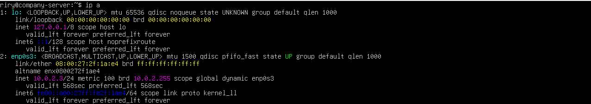
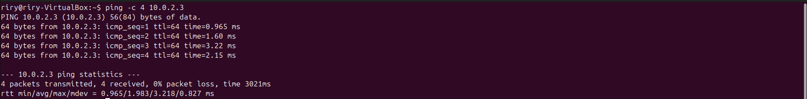
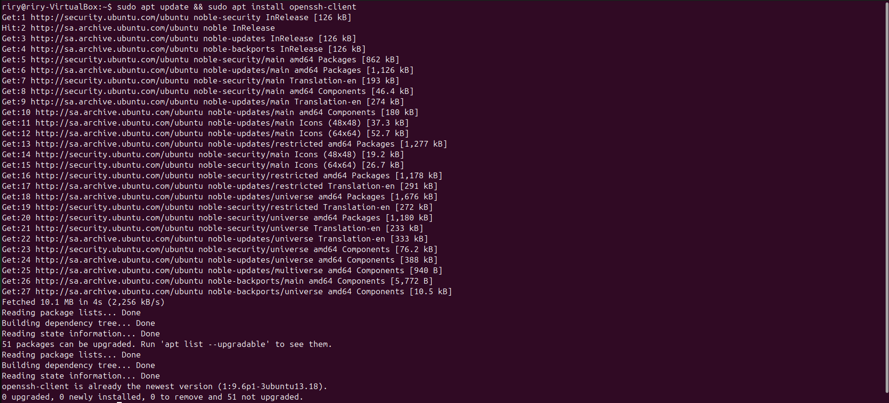
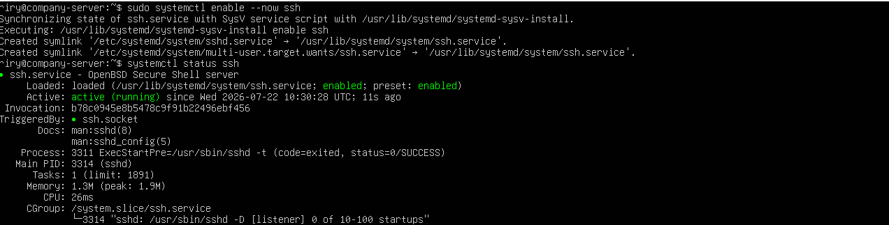
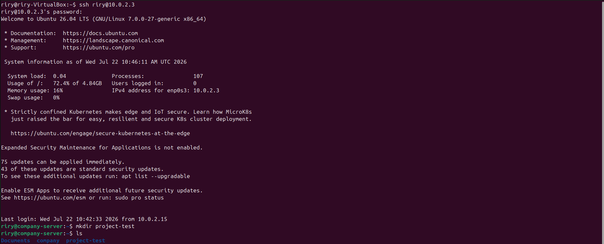

# Lab 04 – SSH (Secure Shell)

## Objective

Learn how to configure, manage, and test the SSH service on Ubuntu Linux to enable secure remote administration between two Linux systems.

## Scenario

A company has two Linux machines on the same network: one acts as a server and the other as a client. The system administrator must configure the server to allow secure remote access using SSH, verify that the service is operating correctly, and confirm that users can remotely log in and manage the server.

## Implementation

- Identified the server's IP address and verified network connectivity from the client.
- Verified the OpenSSH Server and Client packages.
- Verified and managed the SSH service using `systemctl`.
- Configured the SSH service to start automatically at boot.
- Verified that the SSH server was listening on the default port.
- Established a secure SSH connection between the client and server.
- Executed remote commands through the SSH session.

## Commands Used

- `ip a`
- `ping`
- `apt update`
- `apt install`
- `systemctl status`
- `systemctl enable --now`
- `ss -tuln`
- `ssh`

## Screenshots

### Server IP Address

### Network Connectivity Test

### OpenSSH Client Package Verification

### OpenSSH Server Package Verification

### SSH Service Status and Boot Configuration

### SSH Server Listening on Port 22

### SSH Connection and Remote Command Verification

## Skills Covered

- Linux package management
- Linux service management
- Secure remote administration
- Network connectivity verification
- SSH configuration and authentication
- Remote command execution
- Basic Linux server administration

## What I Learned

Through this lab, I learned how to securely access and manage a remote Linux server using SSH. I gained hands-on experience verifying the OpenSSH packages, managing the SSH service with `systemctl`, enabling it to start automatically at boot, confirming that it was listening for incoming connections, and establishing a secure remote session from a client machine. I also learned how to execute commands remotely, demonstrating one of the most common methods of Linux server administration.

## Real-World Relevance

SSH is one of the most essential tools used by Linux system administrators, cloud engineers, and DevOps engineers. It provides a secure method for remotely managing servers, virtual machines, and network devices over a network. Whether administering cloud infrastructure, automating deployment tasks, or maintaining production systems, SSH is a fundamental technology used in professional IT environments.

## Result

Successfully configured an Ubuntu server for secure remote administration using SSH, verified that the SSH service was operating correctly and configured to start automatically at boot, confirmed network connectivity, and established a secure remote connection to execute commands on the server.
