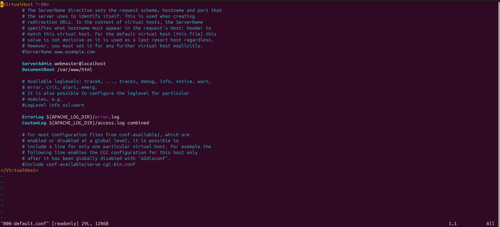
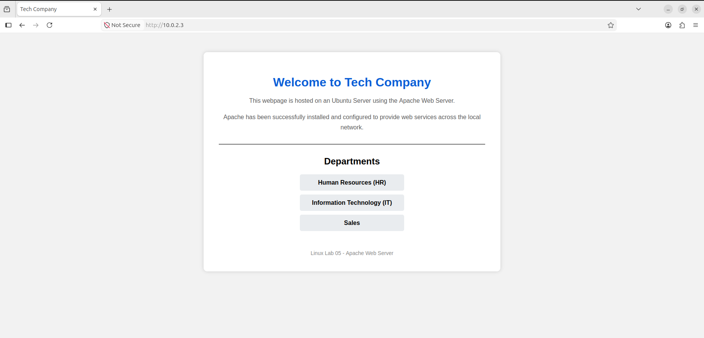

# Lab 05 - Apache Web Server

## Objective

Install and configure the Apache Web Server on Ubuntu Server, host a custom webpage, and verify that the web service is accessible from a client machine.

---

## Scenario

A small company requires an internal web server to host its homepage for employees. As the system administrator, the goal is to deploy Apache, configure the web service, customize the default webpage, and verify that users on the local network can successfully access it through a web browser.

---

## Implementation

- Verified network connectivity between the Ubuntu Server and Ubuntu Desktop.
- Installed the Apache Web Server package.
- Verified the Apache installation and checked the installed version.
- Managed the Apache service by checking its status, starting, stopping, restarting, and enabling it to start automatically at boot.
- Verified that Apache was listening for incoming HTTP connections.
- Explored the Apache configuration files to identify the default website configuration.
- Located the **DocumentRoot** by inspecting the default virtual host configuration.
- Created a backup of the original `index.html` before making any modifications.
- Replaced the default Apache webpage with a custom company homepage.
- Verified that the webpage was successfully served to the client using a web browser.

---

## Commands Used

- `ping`
- `apt update`
- `apt install`
- `systemctl status`
- `systemctl enable --now`
- `ss -tuln`
- `ssh`

---

## Screenshots

### Network connectivity verification.

### Apache installation and version.

### Apache service status.

### Apache listening on port 80.

### Apache configuration showing the DocumentRoot.

### Backup of index.html.

### Custom webpage displayed in Firefox.

---

## Skills Covered

- Apache Web Server installation
- Linux service management
- Package management
- Apache configuration
- DocumentRoot identification
- File backup
- HTML webpage deployment
- Network connectivity testing
- Client-server communication
- Basic web hosting

---

## What I Learned

- How to install and configure the Apache Web Server on Ubuntu.
- How Apache uses the **DocumentRoot** to locate website files.
- The purpose of the default virtual host configuration (`000-default.conf`).
- The importance of creating backups before modifying system files.
- The difference between using administrative privileges and changing file ownership.
- How Linux clients access web services over HTTP.
- How to verify that a web server is running and serving webpages correctly.

---

## Real-World Relevance

Apache is one of the most widely used web servers in production environments. System administrators frequently install, configure, and maintain Apache to host websites, internal portals, APIs, and web applications. Understanding Apache service management, website deployment, and configuration files provides essential skills for Linux administration and cloud computing environments.

---

## Result

Successfully installed and configured the Apache Web Server on Ubuntu Server, deployed a custom company webpage, and verified that the website was accessible from the Ubuntu Desktop client through the local network.
