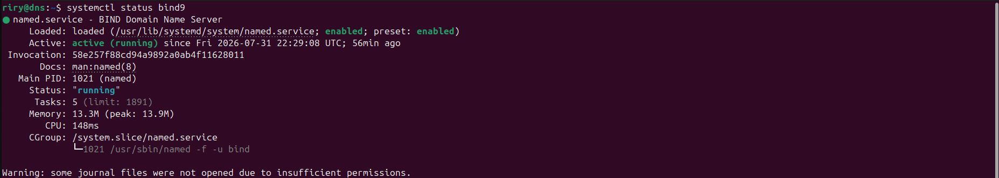
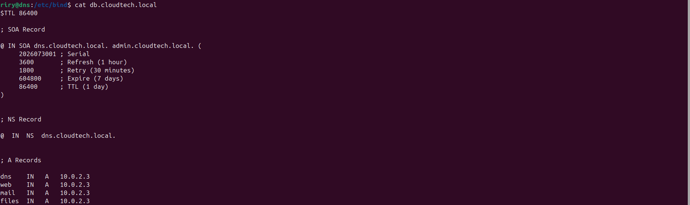
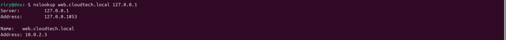

# Lab 06 - DNS Server (BIND9)

## Objective

Configure a BIND9 DNS server on Ubuntu Server by creating a forward lookup zone, defining DNS records, validating the configuration, and testing name resolution.

---

## Scenario

A company needs an internal DNS server to resolve hostnames for its internal services instead of relying on IP addresses. In this lab, a BIND9 DNS server is configured to provide name resolution for services such as the web server, mail server, and file server within the `cloudtech.local` domain.

---

## Implementation

- Installed and verified the DNS server.
- Created a forward lookup zone for the company domain.
- Configured the DNS server to use the new zone.
- Added the required DNS records for the internal services.
- Validated the DNS configuration.
- Started the DNS service.
- Tested successful hostname resolution.

---

## Commands Used

```
sudo apt update && sudo apt install bind9
apt list --installed | grep bind
sudo systemctl status bind9
sudo vim /etc/bind/named.conf.local
sudo vim /etc/bind/db.cloudtech.local
sudo named-checkzone cloudtech.local /etc/bind/db.cloudtech.local
sudo named-checkconf -z
sudo systemctl restart bind9
nslookup web.cloudtech.local 127.0.0.1

```

---

## Screenshots










---

## Skills Covered

- DNS fundamentals
- BIND9 installation and configuration
- Forward lookup zones
- DNS records (SOA, NS, and A)
- DNS zone management
- Linux service management
- Configuration validation
- DNS troubleshooting

---

## What I Learned

This lab helped me understand how DNS translates hostnames into IP addresses and how to configure a BIND9 server for an internal network. I also learned the purpose of SOA, NS, and A records, how to validate DNS configurations before deployment, and how to troubleshoot configuration issues.

---

## Real-World Relevance

DNS is a core service in enterprise environments, allowing users and applications to access resources using hostnames instead of IP addresses. Linux administrators and cloud engineers configure and maintain DNS servers to provide reliable name resolution for internal services and infrastructure.

---

## Result

Successfully deployed and configured a BIND9 DNS server, created a forward lookup zone, added DNS records, validated the configuration, started the service, and verified successful hostname resolution.
