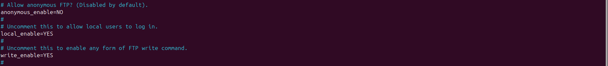
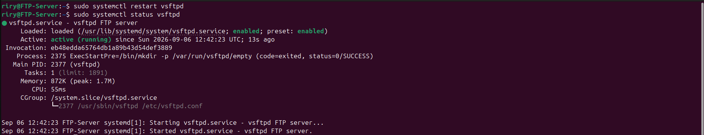
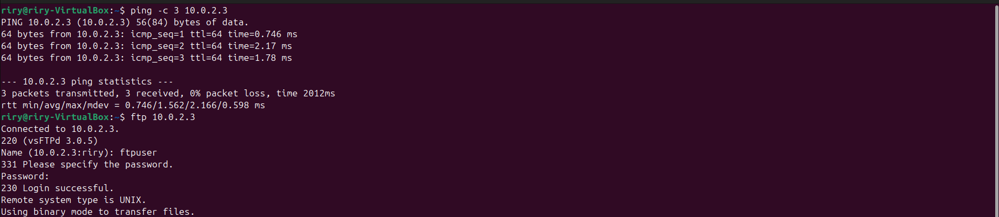
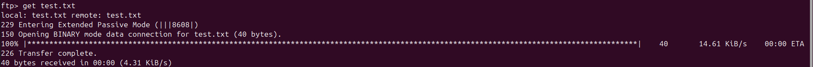
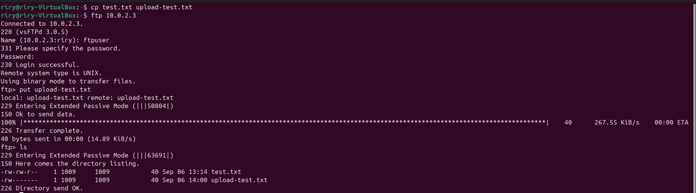
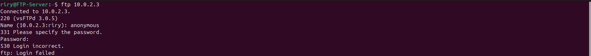

# Lab 08 - FTP Server

## Objective

Configure a vsftpd FTP Server on Ubuntu Server to allow authenticated users to upload and download files.

---

## Scenario

A small company wants to provide employees with a centralized file transfer service. An FTP server is deployed to allow authorized users to transfer files while preventing anonymous and unauthorized access.

---

## Implementation

* Installed and configured the vsftpd FTP Server.
* Created a dedicated FTP user and enabled local authentication.
* Enabled file uploads and disabled anonymous access.
* Tested file upload and download between the server and client.
* Verified file permissions, ownership, and access restrictions.

---

## Commands Used

* `apt install vsftpd`
* `systemctl restart vsftpd`
* `systemctl status vsftpd`
* `ss -tuln | grep :21`
* `adduser ftpuser`
* `nano /etc/vsftpd.conf`
* `ftp`
* `get`
* `put`

---

## Screenshots

---

## Skills Covered

* FTP Server Configuration
* vsftpd Administration
* Linux User Management
* Linux File Permissions
* File Ownership
* Service Management
* File Transfer
* Access Control

---

## What I Learned

* How to configure a vsftpd FTP Server.
* How to create and authenticate an FTP user.
* How to upload and download files using FTP.
* How Linux permissions and ownership control user access.
* How to restrict unauthorized and anonymous FTP access.

---

## Real-World Relevance

FTP provides a method for transferring files between systems through a centralized server. Understanding FTP, authentication, permissions, and access control is useful for Linux server administration and infrastructure management.

---

## Result

Successfully deployed and configured a vsftpd FTP Server that allowed authenticated users to upload and download files while restricting unauthorized access and disabling anonymous FTP access.
