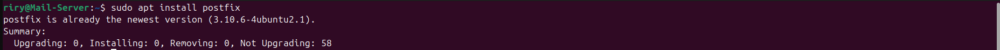
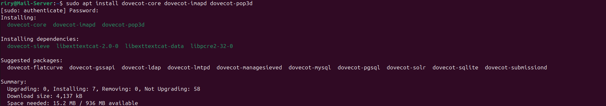
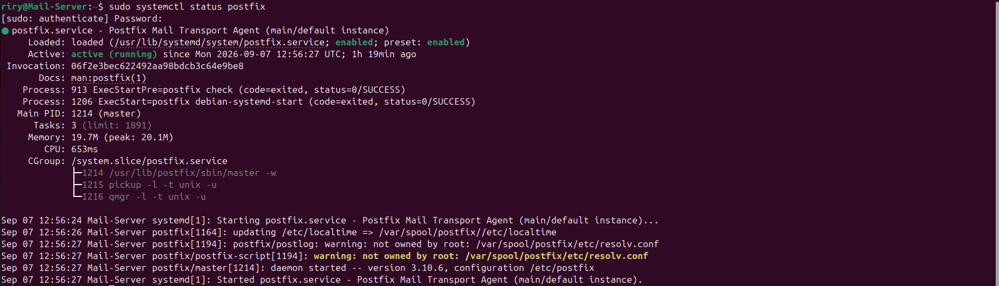
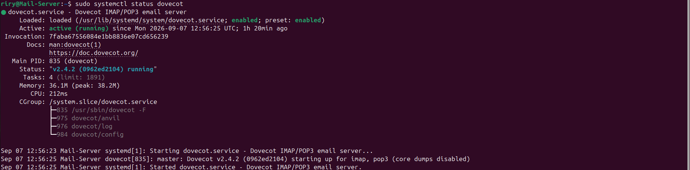
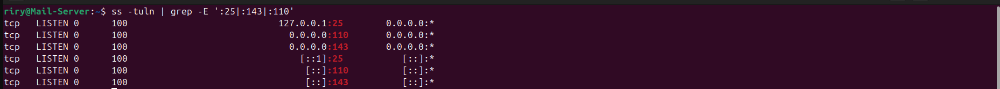
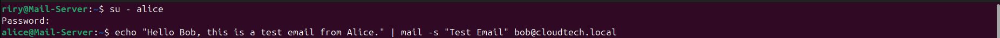
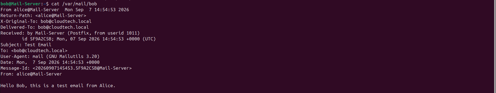

# Lab 09 - Mail Server

## Objective

Configure a Postfix and Dovecot Mail Server on Ubuntu Server to allow authenticated users to send and receive emails.

---

## Scenario

A small company wants to provide employees with an internal email service. A Mail Server is deployed to allow authorized users to send and receive emails using SMTP and POP3 while maintaining controlled access.

---

## Implementation

* Installed and configured the Postfix Mail Server.
* Configured the mail domain and local mail delivery.
* Created dedicated Linux users for email communication.
* Installed and configured Dovecot to provide POP3 access.
* Enabled and started the required mail services.
* Tested email communication by sending a message from Bob and receiving it through Alice.

---

## Commands Used

* `apt install postfix`
* `apt install dovecot-pop3d`
* `systemctl enable --now postfix`
* `systemctl enable --now dovecot`
* `systemctl status postfix`
* `systemctl status dovecot`
* `mail`

---

## Screenshots

---

## Skills Covered

* Mail Server Configuration
* Postfix Administration
* Dovecot Administration
* SMTP
* POP3
* Linux User Management
* Service Management
* Email Delivery
* Access Control

---

## What I Learned

* How to configure a Mail Server using Postfix and Dovecot.
* How SMTP is used for sending emails.
* How POP3 is used for receiving emails.
* How to create and manage users for email communication.
* How to manage and verify mail services on Linux.
* How to test email delivery between users.

---

## Real-World Relevance

Mail servers can be deployed in cloud environments to provide centralized email services for organizations. Understanding mail server configuration, SMTP, POP3, authentication, and Linux service management provides a foundation for managing cloud-based infrastructure and services.

---

## Result

Successfully deployed and configured a Postfix and Dovecot Mail Server that allowed authenticated users to send and receive emails using SMTP and POP3.
