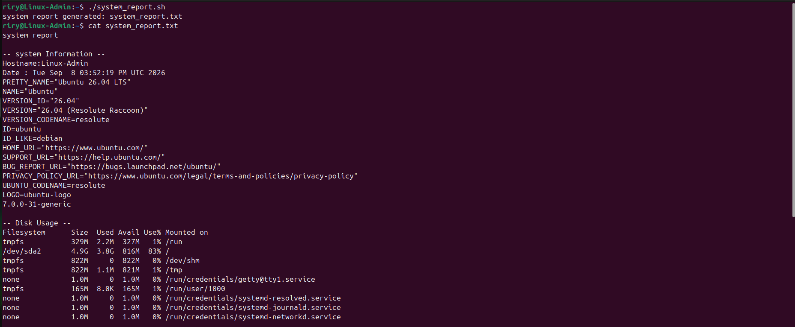

# Lab 10 - Bash Automation

## Objective

Create a Bash script to automate common Linux system administration tasks and generate a system report.

---

## Scenario

A system administrator wants a simple way to collect important server information and check the status of essential services without running each command manually.

---

## Implementation

* Created a Bash script named `system_report.sh`.
* Used variables to store system information and the report filename.
* Collected system, disk, memory, and network information.
* Checked the status of SSH, Apache, and BIND9 services.
* Used output redirection to generate `system_report.txt`.
* Tested the script and verified the generated report.

---

## Commands Used

* `hostname`
* `date`
* `cat /etc/os-release`
* `uname -r`
* `df -h`
* `free -h`
* `ip a`
* `ip route`
* `systemctl is-active`
* `chmod +x`
* `./system_report.sh`
* `cat system_report.txt`

---

## Screenshots

---

## Skills Covered

* Bash Scripting
* Linux Automation
* System Administration
* System Monitoring
* Variables
* Output Redirection
* Service Management

---

## What I Learned

* How to create and execute Bash scripts.
* How to use variables and command substitution.
* How to automate common Linux administration tasks.
* How to generate a system report using output redirection.
* How to check system resources and service status.

---

## Real-World Relevance

Bash automation is widely used by system administrators and cloud engineers to automate repetitive tasks, monitor servers, and manage Linux infrastructure efficiently.

---

## Result

Successfully created and tested a Bash automation script that collected essential Linux system information, checked important services, and generated an automated system report.