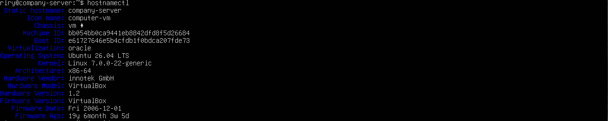

# Lab 01 - Linux Users and Permissions

## Objective

Build a simple Linux company environment to practice user management, groups, ownership, and file permissions.

## Scenario

A small company has two departments:

* HR
* IT

Each department should only access its own folder, while everyone can access a shared folder.

## Implementation

* Changed the hostname
* Created the company directory structure
* Created users
* Created groups
* Added users to their groups
* Configured ownership using `chown`
* Configured permissions using `chmod`
* Tested user access

## Commands Used

* hostnamectl
* mkdir
* adduser
* groupadd
* usermod
* chmod
* chown
* ls

## Screenshots

## What I Learned

- Managing Linux users and groups
- Configuring file ownership and permissions
- Organizing access using Linux groups
- Verifying user permissions through testing

## Result

Successfully configured a Linux environment with proper user and group permissions for different departments.
